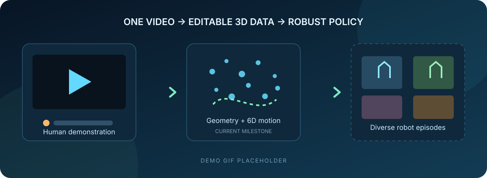
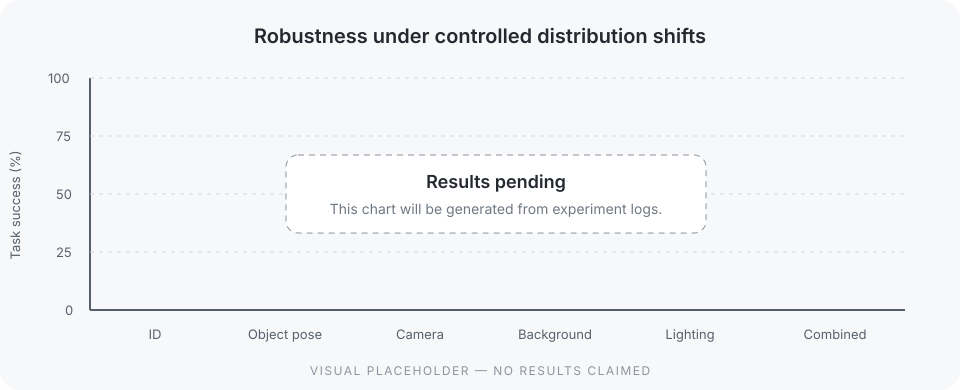

<div align="center">

# OneVideo2Policy

### From one human video to robust robot manipulation data

**A focused reproduction study of geometry-consistent synthetic demonstrations for imitation learning.**

[](https://www.python.org/)
[](https://docs.astral.sh/ruff/)
[](#testing)
[](LICENSE)
[](#project-status)



<sub>Project media placeholder — a real input-to-output demo will replace this panel after the first tracking milestone.</sub>

</div>

## The question

Robot imitation policies need diverse demonstrations, but collecting them usually
means more teleoperation time, robot access, and hardware wear. OneVideo2Policy asks:

> Can a single monocular human demonstration be converted into diverse,
> geometrically consistent synthetic robot demonstrations—and do they improve
> robustness more than ordinary 2D image augmentation?

This project narrows that question to one reproducible **Place** task: pick up a
rigid object and place it on a rigid target. The goal is not to reimplement every
component of Video2Robo or claim a new algorithm. It is to build a careful,
measurable reproduction of its central data-generation claim.

## At a glance

| | Project contract |
|---|---|
| **Input** | One 10–20 second monocular RGB human demonstration |
| **Task** | Tabletop pick, transfer, and place with rigid objects |
| **Representation** | Per-object 3D Gaussian representation and SE(3) trajectory |
| **Synthetic output** | Robot demonstrations with geometric and appearance variation |
| **Policy** | Diffusion Policy using front/side RGB and robot joint state |
| **Main comparison** | One demo vs. 2D augmentation vs. 3D geometry vs. full 3DGS |
| **Current focus** | Independent perception annotation and gate evaluation |

## System overview

```mermaid
flowchart LR
    A[One monocular<br/>human video] --> B[Segment and<br/>track objects]
    B --> C[Recover depth and<br/>object geometry]
    C --> D[Estimate 6D<br/>object trajectories]
    D --> E[Extract relative<br/>object skill]
    E --> F[Synthesize robot<br/>trajectory]
    F --> G[Render diverse<br/>3DGS demonstrations]
    G --> H[Train Diffusion<br/>Policy]
    H --> I[Evaluate controlled<br/>distribution shifts]

    classDef active fill:#e8f5ff,stroke:#1677a8,stroke-width:2px,color:#102a43;
    classDef future fill:#f6f8fa,stroke:#8c959f,stroke-dasharray:5 5,color:#57606a;
    class A,B,C,D active;
    class E,F,G,H,I future;
```



Solid nodes are the current milestone; dashed nodes are intentionally gated future
work. Heavy model integrations are added only after their upstream measurements are
stable.

## Project status

The repository is an early research scaffold. It already includes the model-agnostic
foundation needed to make the first experiments reproducible; it does **not** yet
claim an end-to-end result.

| Component | Status | Evidence / next deliverable |
|---|:---:|---|
| Place benchmark and thresholds | ✅ | [`configs/place.yaml`](configs/place.yaml) |
| Video sampling and manifests | ✅ | `ov2p prepare-video` |
| SE(3), relative motion, tracking metrics | ✅ | Unit tested core package |
| SAM2 and CoTracker3 adapters | ✅ | CUDA run, overlay, and diagnostics complete |
| Independent perception gate | ✅ | HOI4D GT gate passes with controlled reseeding |
| TRELLIS and VGGT adapters | 🟡 | Interfaces ready; model selection next |
| 6D tracking ablation | ⬜ | Compare with/without tracked-point loss |
| Synthetic robot demonstrations | ⬜ | Starts after tracking Gate B |
| Diffusion Policy benchmark | ⬜ | Starts after generation Gate C |

Legend: ✅ implemented · 🟡 contract/scaffold ready · ⬜ planned

## Method

### 1. Recover temporally coherent object motion

The source and target are segmented in the first frame and associated over time with
tracked pixels. Initial pose fitting combines rendered RGB, depth, and mask losses.
Later frames warm-start from the preceding estimate and add a correspondence term:

$$
\mathcal{L} = \lambda_c\mathcal{L}_{RGB}
+ \lambda_d\mathcal{L}_{depth}
+ \lambda_m\mathcal{L}_{mask}
+ \lambda_t\mathcal{L}_{track}.
$$

The tracking-loss ablation is a first-class experiment because symmetric objects can
look correct frame by frame while producing an unstable trajectory.

### 2. Represent the demonstrated skill as relative motion

For source and target poses $T_s(t)$ and $T_t(t)$, the task trajectory is:

$$
T_{rel}(t) = T_t(t)^{-1}T_s(t).
$$

This separates the demonstrated relationship from the original scene layout. A
manually specified object-relative grasp transform is acceptable for this study; the
research question is data diversity, not automatic grasp discovery.

### 3. Generate controlled 3D variation

Once tracking passes its gate, synthetic episodes will vary five independent factors:

- source and target pose;
- nearby camera pose and focal length;
- background;
- tabletop texture;
- Gaussian color-based lighting.

Each episode will retain aligned RGB observations, robot actions, joint positions,
object poses, and generation metadata.

## Evaluation design

The central benchmark holds the policy architecture fixed and changes only the
training data:

| Training data | ID | Object pose | Camera | Background | Lighting | Combined |
|---|---:|---:|---:|---:|---:|---:|
| One demonstration | — | — | — | — | — | — |
| + standard 2D augmentation | — | — | — | — | — | — |
| + geometry-only 3D augmentation | — | — | — | — | — | — |
| **+ full 3DGS augmentation** | — | — | — | — | — | — |

All cells are intentionally blank until measured. Planned secondary studies test
synthetic dataset scaling ($N \in \{10, 50, 100, 250, 500\}$), individual augmentation
families, and pose tracking with versus without correspondence loss.

<div align="center">

<br>
<sub>Results placeholder — generated from logged experiment outputs once Gate D passes.</sub>
</div>

## Quick start

### Requirements

- Python 3.10+
- [`uv`](https://docs.astral.sh/uv/)
- A CUDA-capable GPU later, for perception and reconstruction models

### Install and verify

```bash
git clone <your-fork-or-repository-url>
cd onevideo2policy
uv sync --extra dev
uv run ov2p validate-config configs/place.yaml
uv run pytest
```

### Prepare one demonstration

Install the lightweight video extra, then sample a recording at a fixed rate. For
an RGB-D source, pass the directory containing zero-padded NumPy depth frames:

```bash
uv sync --extra video
uv run ov2p prepare-video path/to/place_demo.mp4 \
  --output data/interim/place_demo \
  --fps 30 \
  --depth-dir path/to/depth
uv run ov2p validate-manifest data/interim/place_demo/manifest.json
```

The commands write numbered RGB frames and validate a versioned `manifest.json`
containing original frame IDs, timestamps, and aligned RGB/depth paths. Raw and
generated datasets are ignored by Git.

After producing a binary source-object mask, seed tracking points reproducibly:

```bash
uv run ov2p sample-points source_mask.npy \
  --count 32 --seed 42 --border 4 \
  --output data/interim/place_demo/source_points.npy
```

## Repository structure

```text
onevideo2policy/
├── configs/                  # Frozen task, model, metric, and gate settings
├── data/                     # Local raw/interim/processed data (Git-ignored)
├── docs/                     # Roadmap, experiment log, failure analysis
├── experiments/runs/         # Local run outputs (Git-ignored)
├── results/                  # Tables, plots, and evaluation artifacts
├── scripts/                  # Thin experiment entry points
├── src/onevideo2policy/
│   ├── video/                # Frame preparation and perception protocols
│   ├── reconstruction/       # Depth/reconstruction protocols
│   ├── pose_tracking/        # Tracking losses and temporal metrics
│   ├── skill/                # Relative motion and Place phase extraction
│   ├── generation/           # Synthetic data engine milestone
│   ├── policy/               # Diffusion Policy milestone
│   └── evaluation/           # Dataset and robustness metrics
└── tests/                    # Fast, model-free unit tests
```

Optional SAM2 and CoTracker3 installation, pinned revisions, and adapter usage are
documented in [`docs/perception-models.md`](docs/perception-models.md).

The RGB-D import path for HOI4D's official motion masks is documented in
[`docs/hoi4d-integration.md`](docs/hoi4d-integration.md).

## Research gates

The project uses explicit GO/NO-GO checks to prevent downstream ML from hiding an
upstream geometry failure:

1. **Reconstruction:** both objects are recognizable from useful nearby views.
2. **Tracking:** identity, mask IoU, track survival, reprojection error, and temporal
   jitter meet the frozen thresholds.
3. **Generation:** at least 80–90% of episodes satisfy task and kinematic constraints.
4. **Learning:** the policy succeeds in-distribution before robustness testing.
5. **Value:** 3D augmentation is compared honestly with 2D augmentation under
   controlled shifts—even if the result is negative.

Thresholds live in [`configs/place.yaml`](configs/place.yaml), and the complete plan
is documented in [`docs/roadmap.md`](docs/roadmap.md). The immediate, acceptance-test
driven execution plan is in [`docs/next-steps.md`](docs/next-steps.md). Before adding
data, use the [`place_demo` recording and sourcing guide](docs/recording-guide.md).

## Testing

The current tests are CPU-only and cover transform validation and composition,
relative trajectories, mask IoU, point survival, reprojection loss, translation
jitter, Place phase extraction, and configuration loading.

```bash
uv run ruff check .
uv run pytest
```

## Scope and limitations

- One rigid-object Place task comes before additional tasks.
- The input claim remains monocular RGB; depth estimates are inferred, not captured.
- Grasp pose is manually specified in the planned robot synthesis stage.
- Deformable objects, bimanual control, real-robot deployment, and VLA training are
  outside the initial scope.
- SAM2, CoTracker3, TRELLIS, VGGT, Robosuite, and Diffusion Policy are not vendored.
  Their versions and installation steps will be pinned as each adapter lands.

## Acknowledgements

This project is inspired by **Video2Robo** and studies a deliberately narrower version
of its core claim. It is an independent reproduction and is not affiliated with the
original authors. Third-party model citations and licenses will be added alongside
their integrations.

## License

Released under the [MIT License](LICENSE).
