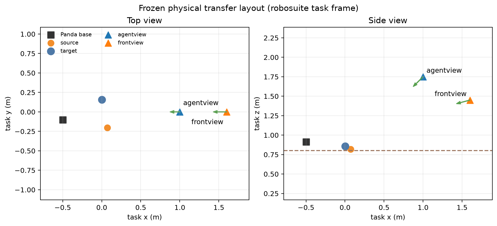

# Physical task fixtures

The selected policy was trained on a 38.321 mm orange sphere and a blue bowl with a
99.123 mm outer diameter and 56.933 mm height. The previously supplied 30 mm object
falls outside the frozen 10% size tolerance.

The repository includes printable replacements:

- [`source-ball-38.321mm.stl`](../assets/physical/source-ball-38.321mm.stl)
- [`target-bowl-99.123x56.933mm.stl`](../assets/physical/target-bowl-99.123x56.933mm.stl)
- [`manifest.json`](../assets/physical/manifest.json), containing hashes, triangle
  counts, measured extents, and watertightness checks.

Regenerate and audit them with:

```bash
PYTHONPATH=src .venv/bin/python scripts/generate_physical_task_assets.py \
  --output assets/physical
```

Both STL files use millimetres. Print the source with a smooth, closed surface and the
target with a stable base. Use matte orange and matte blue finishes matching the
training observations. Avoid glossy coatings, sharp seams, loose ballast, or surface
features that can catch the gripper.

Measure the completed parts with callipers and enter the actual dimensions in the
physical calibration observations. The software preflight, rather than the nominal
CAD dimensions, decides whether the printed parts remain within the 10% gate.

## Camera and task layout



The figure uses the policy's robosuite task frame. Camera arrows show the optical
forward direction. The physical calibration fits this task frame to robot-base
coordinates and checks both camera poses against the frozen reference. Regenerate the
figure with:

```bash
MPLBACKEND=Agg .venv/bin/python scripts/render_physical_layout.py
```
